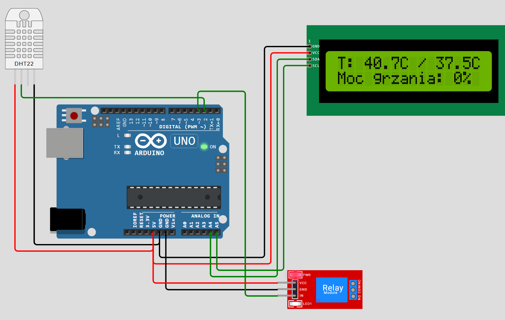
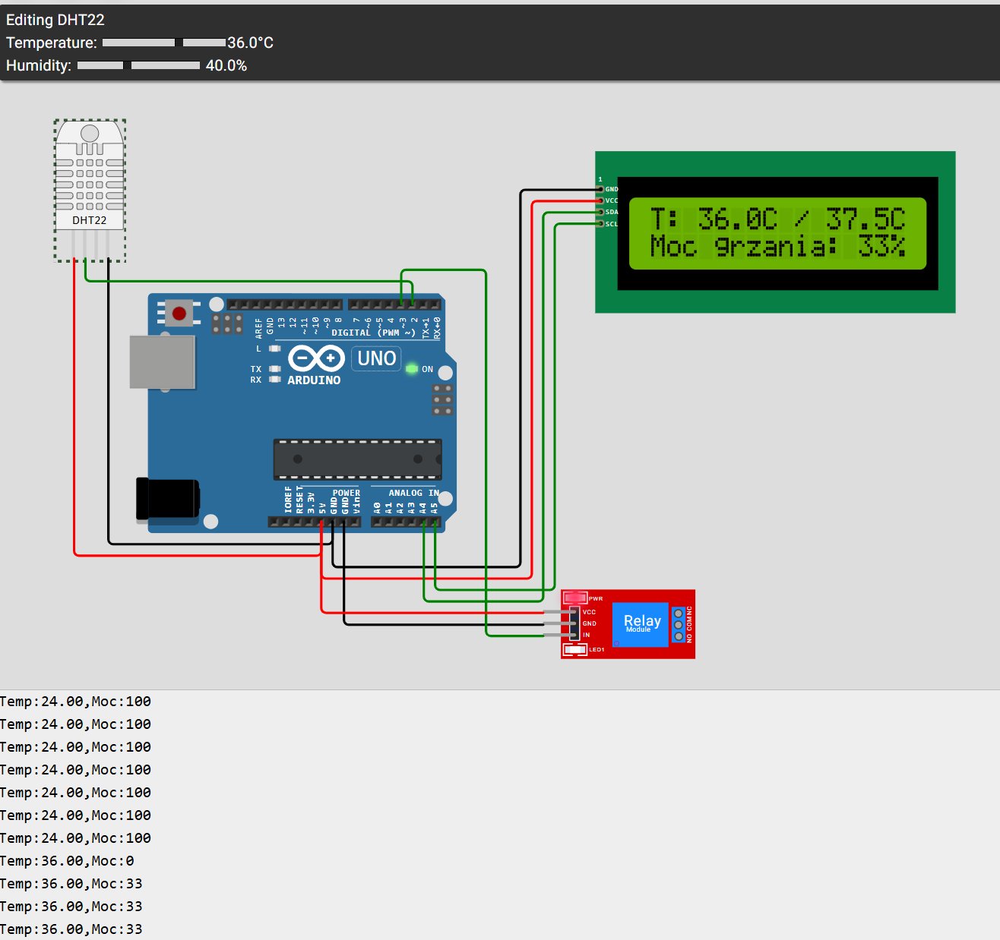
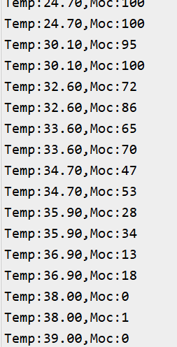

# Projekt Inkubatora jaj

## Krzysztof Falandysz, Aleksander Drozdowicz

## 1. Cel Projektu

 **Celem projektu było zaprojektowanie i zaprogramowanie systemu sterowania mikroklimatem w inkubatorze jaj. Układ ma za zadanie precyzyjnie utrzymywać zadaną temperaturę 37.5°C przy użyciu algorytmu regulacji PID.**

 ## 2. Hardware

1. Mikrokontroler: Płytka Arduino Uno 

2. Czujnik temperatury: DHT22 

3. Element wykonawczy: Moduł Relay jako symulacja grzałki sterowanej sygnałem PWM

4. Interfejs użytkownika: Wyświetlacz LCD 16x2 z konwerterem I2C.

## 3. Schemat Połączeń / PinOut

| Komponent | Pin komponentu | Pin Arduino Uno | Kolor przewodu (na schemacie) |
| :--- | :--- | :--- | :--- |
| **DHT22 (Czujnik)** | VCC | 5V | Czerwony |
| | SDA (Data) | D2 | Zielony |
| | GND | GND | Czarny |
| **LCD 1602 (I2C)** | GND | GND | Czarny |
| | VCC | 5V | Czerwony |
| | SDA | A4 | Zielony |
| | SCL | A5 | Zielony |
| **Moduł Przekaźnika** | VCC | 5V | Czerwony |
| | GND | GND | Czarny |
| | IN (Sygnał) | D3 | Zielony |

* **Zasilanie:**
    * `5V` -> Połączone z VCC wszystkich trzech modułów (DHT22, LCD, Przekaźnik)
    * `GND` -> Połączone z GND wszystkich trzech modułów (DHT22, LCD, Przekaźnik)
* **Piny cyfrowe (Digital):**
    * `D2` -> DHT22 Data (SDA)
    * `D3` -> Wejście przekaźnika (IN)
* **Piny analogowe (I2C):**
    * `A4` -> LCD SDA
    * `A5` -> LCD SCL

## 4. Algorytm i Logika działania Regulatora PID

Tradycyjne układy dwustawne On/Off powodują ciągłe wahania temperatury wokół punktu nastawy, bo grzałka działa na 100% mocy, dopóki nie przekroczy progu, a po wyłączeniu układ siłą rozpędu i tak jeszcze przez chwilę się nagrzewa. W inkubatorze jaj takie wahania mogłyby uszkodzić zarodki.

Aby temu zapobiec, w projekcie zaimplementowano regulator PID (Proporcjonalno-Całkująco-Różniczkujący, z ang Proportional Integral Derivitive). Zamiast operacji binarnych, algorytm w każdej sekundzie oblicza dokładną, procentową moc grzania w zakresie od 0% do 100% za pomocą sygnału PWM (Pulse Width Modulation)

Podstawą działania algorytmu jest ciągłe wyliczanie błędu e, który zdefiniowano jako:

$$e(t) = T_{zadana} - T_{aktualna}$$

Sygnał sterujący wyjściem u(t) jest sumą trzech niezależnych członów:

$$u(t) = P + I + D$$

### 4.1 Człon P - Proporcjonalny (*Proportional*)

Człon proporcjonalny odpowiada za natychmiastową reakcję układu. Jego wartość jest wprost proporcjonalna do aktualnego błędu:

$$P = K_p \cdot e(t)$$

**Działanie w projekcie**: Jeśli w inkubatorze jest bardzo zimno (np. 20°C przy zadanych 37.5°C, błąd wynosi aż $17.5. Wtedy człon P generuje stosunkowo dużą wartość, wymuszając przy tyn maksymalne grzanie. Gdy temperatura zbliża się do celu (np. wynosi 37.0°C), błąd e spada do 0.5, a człon P automatycznie zmniejsza moc, aby uniknąć temperatury zbyt wysokiej.

### 4.2 Człon I - Całkujący (*Integral*)

Człon całkujący sumuje błędy z poprzednich kroków czasowych ($dt$). Jego zadaniem jest eliminacja błędu ustalonego:

$$I = K_i \cdot \int_{0}^{t} e(\tau) d\tau$$

### 4.3 Człon D - Różniczkujący (*Derivitive*)

Człon różniczkujący reaguje na szybkość zmian błędu, patrzy na to, jak szybko temperatura rośnie lub spada:

$$D = K_d \cdot \frac{de(t)}{dt}$$

**Działanie w projekcie**: Jeśli temperatura w inkubatorze rośnie bardzo szybko, człon D działa jak hamulec. Mimo że wciąż jesteśmy poniżej temperatury zadanej, człon D wykrywa szybką dynamikę zmian i profilaktycznie odejmuje moc od całkowitego sygnału sterującego. Dzięki temu proces nagrzewania idealnie i łagodnie wyhamowuj dokładnie na linii 37.5°C.

### 4.4. Wykorzystane źródła i literatura

W celu poprawnego sformułowania algorytmu i jego implementacji wspomogliśmy się następującymi materiałami dostępnymi na internecie: 

- **Materiały pomocnicze do laboratoriów z Podstaw Automatyki**: Regulatory PID i dobór ich nastaw, Wydział Elektrotechniki i Automatyki / Wydział Elektroniki, Telekomunikacji i Informatyki, Politechnika Gdańska. https://eia.pg.edu.pl/documents/184139/28394374/PA%20T13_materialy_pomocnicze.pdf

- **Kanał RealPars**: PID Controller Explained [Materiał wideo], YouTube, 2021. Dostęp online: https://www.youtube.com/watch?v=fv6dLTEvl74

- **Kaczorek T.: Teoria sterowania i systemów**, Tom 1, Wydawnictwo Naukowe PWN, Warszawa.

## 5. Instrukcja Obsługi i Uruchomienia

1. Proszę otworzyć przeglądarkę internetową i wejść w link do symulatora online Wokwi: https://wokwi.com/projects/465000200739658753.
2. Proszę kliknąć zielony przycisk uruchomienia (Play) w górnej części ekranu.
3. Symulator w godzinach popołudniowych może być mocno obciążony, więc czasami trzeba chwilę poczekać w kolejce. Po zainicjowaniu systemu na ekranie LCD pojawi się aktualna temperatura oraz procentowa moc grzania. 
4. Testowanie układu: Proszę kliknąć na czujnik DHT22. Następnie proszę użyć suwaka temperatury, który pojawi się po kliknięciu na czujnik: Później ustawić temperaturę na niską i sukcesywnie ją zwiększać do poziomu 37.5. Wszystkie zmiany będzie widać w logach na dole ekranu.

